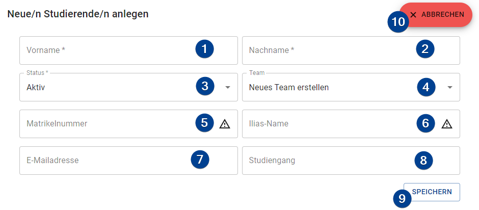

import Roles from '../../src/components/roles/Roles';
import IconInText from '../../src/components/icon-in-text/IconInText';
import MenuIcon from './assets/icons/dots-vertical.svg';
import GenerateIcon from './assets/icons/table-arrow-down.svg';

<Roles roles={['tutor']} />

## Student Overview

The Student Overview page shows all students in your tutorial.
You can see which students are in which team and who would have achieved the "Schein" right now.
Furthermore, this is the page where you can create students and edit their information.

## Create Students

To create new students in your tutorial click the "+ New" button on the upper right. It opens up the following form:

1.  **Firstname** (required): The firstname of the student.

1.  **Lastname** (required): The last name of the student.

1.  **Status** (required): The status of the student. There are three statuses available:

    - `ACTIVE`: The student is still activly participating in the course.
    - `INACTIVE`: The student is not participating anymore (ie has aborted the course).
    - `HAS SCHEIN`: The student is participating in the course but already has a valid Schein from an earlier term.

1.  **Team** (required): The team of the student.
    The TMS automatically selects the first team with a free slot (slot counts are configured by the admin). If no such team could be selected the _New team_ option gets selected.
    You can manually select one of three options:

    - _No team_: The student gets not assigned to any team.
    - _New team_: A new team is created and the student assigned to it.
    - _Team #XX_: The student gets assigned to the selected team.

1.  **Matriculation number** (semi-required): The matriculation number of the student. Gets used to map the results to the students later for the corresponding office at the university.

    :::caution
    If a student does not have a matriculation number assigned he/she can still earn points but their results will **not** be printed on the final overview sheet and can **not** be reported to the office.
    :::

1.  **Ilias name** (semi-required): The display name of the student for the ilias system. Used to map online test results to the students in the system.

    :::caution
    If a student does not have an ilias name assigned his/her test results will not be imported into the TMS. Those tests will count as **not passed** for the related students.
    :::

1.  **E-Mail** (optional): An e-mail adress of the student. Can be used for communication between the tutor and the student if one does not want to use the ilias mailing system.

1.  **Course of studies** (optional): The course of studies of the student. The value of this field is currently unused but will be used for statistical purposes in the future.

1.  **Save button**: Creates the new student. Afterwards the form gets resetted (but not closed) and a new student can be created.

1.  **Abort button**: Closes the form without saving the information.

## Import Students

To import students from a CSV file click on the "<IconInText icon={GenerateIcon} /> Generate" button in the upper right. A step-by-step wizard will guide you through the import process.

1. **Import CSV content**: Import the CSV content by either copy & paste the content in the input field or by uploading the file. You can upload the file by clicking the "Upload CSV-file" button and the content will be pasted into the input field after uploading. If the separator is not correctly detected on the next page you can change the seperator on _this_ page using the "Separator" input in the upper right.

   :::tip Drag & Drop
   You can also drag & drop the file on the button
   :::

1. **Map Columns**: The TMS tries to find all needed columns automatically. If the columns are not properly detected you can change them through the dropdown menus on this page. The following columns are supported (_required_ ones must be provided):

   - _Firstname (**required**)_: The firstname of the student.

   - _Lastname (**required**)_: The lastname of the student.

   - _Status_: The status of the student, one of `ACTIVE`, `INACTIVE`, and `NO_SCHEIN_REQUIRED`. Matches the provided value case-insensitive. If no or an invalid value is provided, the status is set to `ACTIVE`.

   - _Team_: An identifier of the team the student is put into. If a number is provided, and a team with that number already exists, the student is put into that team. For all other identifiers, new teams are created. If no value is provided, the student is put into no team.

   - _E-Mail Address_: A valid e-mail address of the student.

   - _Ilias-Name_: The Ilias name of the student.

   - _Matriculation number_: The matriculation number of the student.

   - _Course of studies_: The course of studies of the student.

1. **Review Student Data**: You can review the students that would be generated by the system. For detailed information about the student, click the "Information" button.

## Information about a Student

To access more information about a specific student click on the "Information" button of that student. The [_Student info page_](./student_info) of that student will be opened.

## Edit Students

To edit a student click the menu button <IconInText icon={MenuIcon} /> on it's bar and choose "Edit". The form that opens up is the same one as for the process of creating a student ([see above](#create-students)).

## Delete Students

To delete a student click the menu button <IconInText icon={MenuIcon} /> on it's bar and choose "Delete". A confirmation dialog opens up if you really want to delete the student.

:::warning No restore possible
Deleting a student is **permanent**! Deleted students can **NOT** be restored.
:::

## Send E-Mail

To send an email to a student click the menu button <IconInText icon={MenuIcon} /> on it's bar and choose "E-Mail". This will open up a new e-mail to the student in your default e-mail program.

:::note
If the student does not have an e-mail saved in the system this option will be disabled.
:::
