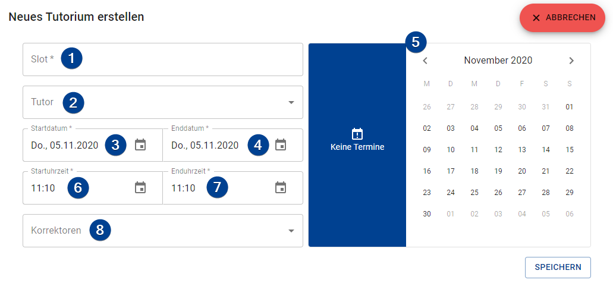
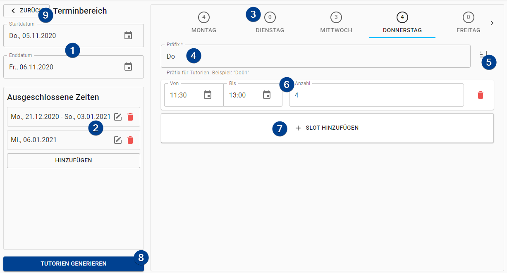

import Roles from '../../src/components/roles/Roles';
import IconInText from '../../src/components/icon-in-text/IconInText';
import MenuIcon from './assets/icons/dots-vertical.svg';
import GenerateIcon from './assets/icons/auto-fix.svg';
import CheckIcon from './assets/icons/check.svg';

<Roles roles={['admin', 'employee']} />

## Create a Tutorial

To create a tutorial click on "+ Add" button in the upper right of the page. A dialog with the following form opens up:

1. **Slot**: The slot part of the name of the tutorial. The name of the tutorial will be displayed in the format "Tutorial #{slot}" at certain locations in the applications (if a short form is required only the slot will be displayed).

1. **Tutor** _(optional)_: Assign a tutor to the tutorial.

   :::note
   Only users with the `TUTOR` role will be shown in the dropdown menu.
   :::

1. **Starting date**: Select a date on which the tutorial starts. The starting date also determines the day of the week on which the tutorial is held. If the ending date was not changed it will be set to the starting date plus 12 weeks.

1. **Ending date**: Set the ending date of the tutorial.

   :::note
   All dates between starting and ending date with the same weekday will be added to the list of dates.
   :::

1. **Date Selection**: You can manually select dates in the calendar or remove already selected dates. The list of dates get prefilled after selecting a starting and an ending date.

   :::caution
   Date selection is **not** limited to the same weekday as the starting date.
   :::

1. **Starting time**: The time on which the tutorial starts. If the ending time was not changed it gets set to the starting time plus 90 minutes.

1. **Ending time**: The time on which the tutorial ends.

1. **Correctors** _(optional)_: You can assign one or more correctors to this tutorial.

   :::note
   Only users with the `CORRECTOR` role will be shown in the dropdown menu.
   :::

## Generate multiple Tutorials

To generate multiple tutorials at once click on the "<IconInText icon={GenerateIcon} /> Generate" button on the upper right. This will open up the form shown below.

:::caution
The form does **not** display any information about tutorials which are already generated in the system.
:::

1. **Starting & Ending Date**: The two dates between the generated tutorials will be hold. All matching weekdays will be added to the list of dates of each tutorial.

1. **Excluded Dates**: You can exclude either single dates or complete date ranges. Those dates will not be added to the list of dates of the tutorials.

1. **Weekday Selection**: Select the day you want to add slots to. Each day tab shows the number of _total_ tutorial slots that will be generated on this day. If the values of a weekday are invalid a red (!) is displayed instead.

1. **Weekday Prefix**: The prefix for the slot names of this weekday. An example of a slot name will be shown below the textfield. It will update as you change the prefix.

1. **Sort Slots**: Sorts the slot by their starting time.

   :::note
   Due to current limitations in the implementation sorting can _not_ be done automatically.
   :::

1. **Slot to generate**: Contains the information about the slots for a specific time frame which will be generated. You can adjust the information in place. It is basically the same form as for adding a slot.

1. **Add slot**: This will open up a form which lets you enter a timeframe and how many tutorials you want to be generated for this time frame. You confirm your input by clicking on <IconInText icon={CheckIcon} />.

1. **Generate Tutorials**: Generates the tutorials with the specified information.

1. **Back**: Go back to the Tutorial Overview Page.

## Manage Tutorials

To manage internal data of a tutorial (students, gradings, ...) click on the "Manage" button on the tutorial. This will open up a page on which you can access all pages a tutor would have access to (see the "Tutorial" section in the sidebar). You can then select the sub-page by selecting it in the dropdown menu in the upper right corner. To go back to the tutorial overview page just click on the "Back to overview" button on the upper left.

## Assign substitutes

To assign substitutes click on the "Substitutes" button on the tutorial. This will open up the [_Substitutes page_](./substitutes).

## Edit & Delete Tutorials

To edit or delete a tutorial click on the menu icon <IconInText icon={MenuIcon} /> on the right of a tutorial and select either the "Edit" or the "Delete" option. By clicking "Edit" a dialog opens up with the same form described above. By clicking "Delete" you will be prompted if you really want to delete the tutorial.

:::caution
If a tutorial has at least one student assigned to it it can **not** be deleted.
:::
